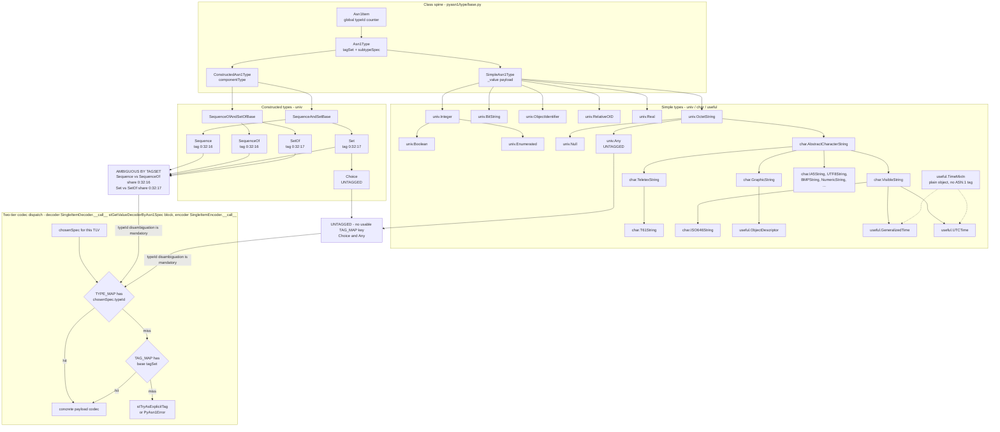
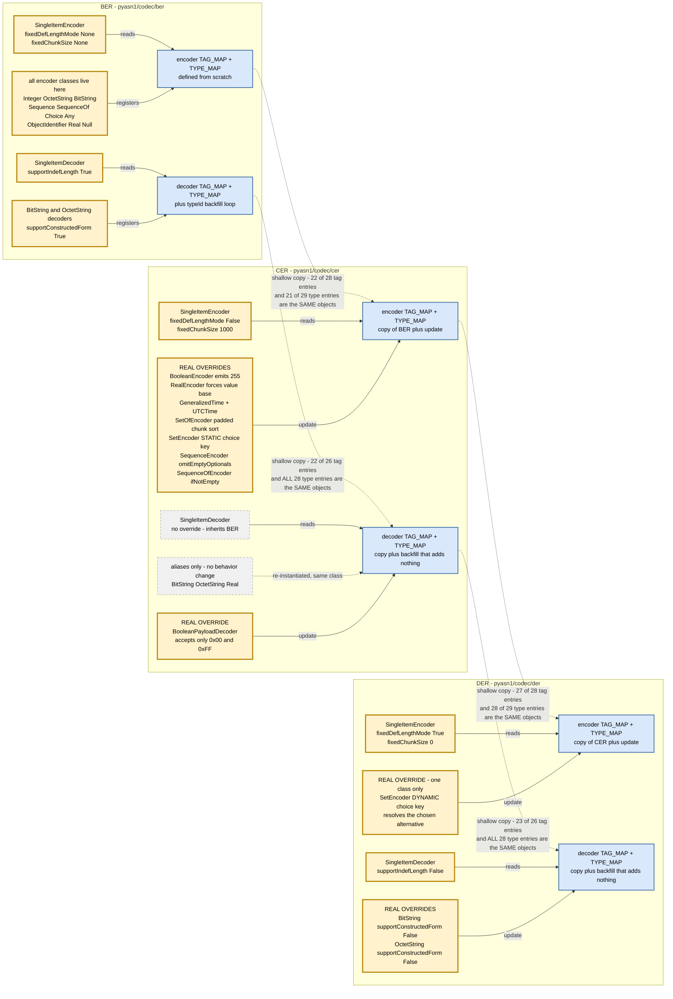
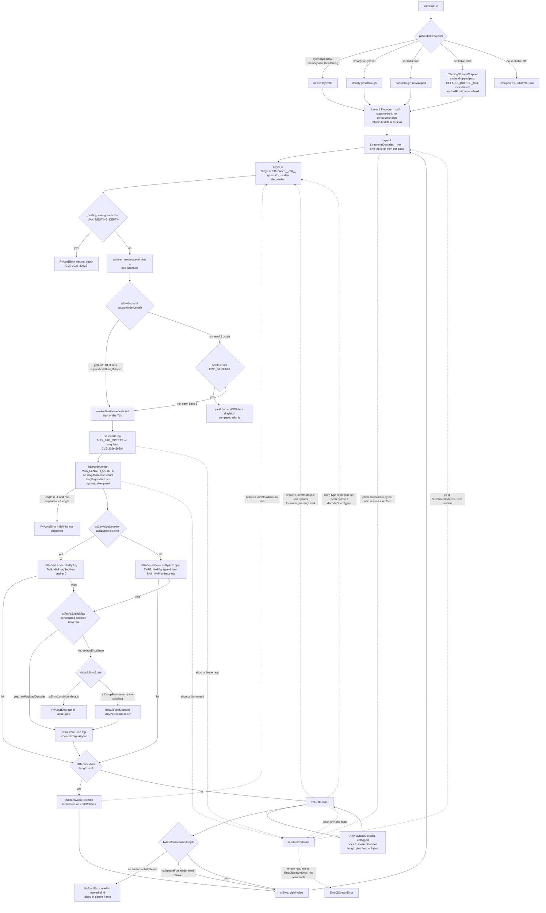

# pyasn1 architecture

pyasn1 implements ASN.1 types and the BER, CER and DER codecs in pure Python.
One decision organizes the whole library: a single object graph plays three
roles. The same objects describe an ASN.1 type to the codecs, hold a decoded
value, and stand as input to an encoder; the `noValue` sentinel marks which
role an object is playing at any moment. Encoding is a pure function over that
graph: it reads the graph and produces bytes, and never alters what it reads.
Decoding is the inverse run as a pipeline: it clones a schema object, then
fills the clone from a generator-driven stream that can suspend on incomplete
input and resume when more bytes arrive.

The chapters follow that shape as a build order for a reimplementer. [The
type system](#the-type-system) builds the graph: tags, constraints, component
schemas, and the sentinel that separates schema from value. [The codec
family](#the-codec-family) builds the translation: one dispatch machinery
shared by BER, CER and DER, and the points where the dialects diverge. [The
decoder pipeline](#the-decoder-pipeline) builds the stream: the state machine
that parses one item, the contract that lets parsing suspend and resume, and
the limits that make hostile input safe to parse. The closing chapters are
inventories: the [security hardening record](#security-hardening-inventory),
the [compatibility surface](#compatibility-surface-looks-dead-is-not), and
the [warts kept on purpose](#known-warts-intentional).

## Orientation

The graph, the translation and the stream all live in one small package.
This chapter fixes the conventions the rest of the document uses to cite
that package, maps its modules, and describes the debug hook that threads
through all three acts.

### Conventions of this document

Code references are symbols, never line numbers: a file plus a class, method
or constant, or a short distinctive expression to grep for. Line numbers are
absent because they rot with every edit. If a cited symbol is missing, the
code has moved or changed; re-verify the claim and update this document in
the same change.

Map sizes, entry counts and test totals are measured values: facts about the
checkout you are reading, kept honest by the same-commit doc-update rule. If
a number looks off, re-measure it rather than assuming the document is right.

Python behavior that an invariant depends on is explained inline at its first
load-bearing use, sized for a reader porting the library: one clause of
language semantics, one clause naming the property a port must reproduce.
Later uses point back to the owning section.

This file is Markdown, and the Sphinx source tree takes only reST, so it sits
at the `docs/` root where the build never looks. The docs build reads only
`docs/source/*.rst` under `-W` (every warning is an error), so Markdown at
the `docs/` root is invisible to it. The `MANIFEST.in` glob picks up only
`Makefile`, `*.rst`, `*.svg` and `conf.py` under `docs/`, so root-level
Markdown is invisible to the sdist as well. Moving this file into
`docs/source/` would drop it from publication with no build error; converting
it to `.rst` without a toctree entry would fail the `-W` build.

Scope searches to `pyasn1/`, `tests/` and `docs/`. A stale copy of the
package can sit under `build/lib/` beside a local `.venv/`, so an unscoped
grep returns phantom matches with wrong line numbers.

Operating rules for the repository, such as test commands, commit hygiene and
the release procedure, live in [AGENTS.md](../AGENTS.md) and are not restated
here.

### Module map

The package is thirty-two modules; four carry most of the weight:
`type/univ.py` (~3,300 lines), `codec/ber/decoder.py` (~2,200),
`codec/ber/encoder.py` (~960), `type/constraint.py` (~750).

| Module | Role |
|---|---|
| `type/base.py` | The class spine: `Asn1Item` → `Asn1Type` → `{SimpleAsn1Type, ConstructedAsn1Type}`, plus the `noValue` sentinel |
| `type/univ.py` | The core universal types: `Integer`, `Boolean`, `BitString`, `OctetString`, `Null`, `ObjectIdentifier`, `RelativeOID`, `Real`, `Enumerated`, `SequenceOf`/`SetOf`, `Sequence`/`Set`, `Choice`, `Any` |
| `type/char.py` | Restricted character string types, mostly deriving from `AbstractCharacterString` |
| `type/useful.py` | `ObjectDescriptor`, `TimeMixIn`, `GeneralizedTime`, `UTCTime`, nothing else |
| `type/tag.py` | `Tag`, `TagSet`, implicit/explicit tagging, the `_tagIdToStr` hex fallback |
| `type/tagmap.py` | `TagMap`: the present/skip/default three-way lookup the decoder runs on |
| `type/namedtype.py` | `NamedTypes`: SEQUENCE/SET component definitions, eagerly precomputed |
| `type/namedval.py` | `NamedValues`, the enumeration/named-bit mapping |
| `type/constraint.py` | Constraint objects and their composition |
| `type/opentype.py` | `OpenType`, the ANY-defined-by mapping |
| `type/error.py` | A *second* `ValueConstraintError`, the one actually raised |
| `codec/streaming.py` | `asSeekableStream`, `CachingStreamWrapper`, `readFromStream`: the resumable-stream engine |
| `codec/ber/decoder.py` | The base decoder: payload decoders, the state machine, every security limit |
| `codec/ber/encoder.py` | The base encoder |
| `codec/ber/eoo.py` | The end-of-octets singleton |
| `codec/cer/*`, `codec/der/*` | Derived codecs, sharing BER's objects by identity |
| `codec/native/*` | Conversion to and from Python dicts, lists and scalars |
| `compat/integer.py` | A single `to_bytes` helper |
| `debug.py` | The logging facility; see [The debug hook](#the-debug-hook) |
| `error.py` | The exception hierarchy rooted at `PyAsn1Error` |

Read [The codec family](#the-codec-family) before touching anything under
`codec/`, even if the change looks local to BER.

### The debug hook

`pyasn1/debug.py` is a flag-based logger consulted through a per-module
global named `LOG`. A module opts in with `debug.registerLoggee(__name__,
flags=...)` at import; `setLogger` then walks the registry and rebinds `LOG`
inside each registered module with `setattr`. The payoff is that `if LOG:`
costs one global load, not a function call, in every hot decode path.
Replacing the rebinding with an attribute lookup adds a function call to
every one of those paths.

The test suite leans on the same hook. `tests/base.BaseTestCase.setUp`
installs `debug.Debug('all', printer=lambda *x: None)`, every flag enabled
with the output discarded, so the whole suite executes every `if LOG:` branch
and a malformed logging format string is a test failure, not dead code.
Removing the null logger from `BaseTestCase` lets a broken format string
reach a release with no test failing; dropping its `tearDown` leaks the
logger into unrelated tests.

## The type system

The object graph is the first act. Everything in `pyasn1/type/` serves one
job: give the codecs a machine-readable description of an ASN.1 type that is
also a container for a decoded value. Schema and value are the same Python
classes, distinguished at runtime by a sentinel, and that single decision
explains most of the strangeness in this layer. The diagram below draws the
layer whole: the class spine in `base.py`,
the derivation graph of the simple and constructed types, and the two-tier
dispatch the codecs run over it.



In the diagram's derivation graph, `Boolean` and `Enumerated` derive from
`Integer`; `Null`, `Any` and `AbstractCharacterString` derive from
`OctetString`; `T61String` derives from `TeletexString`; `ISO646String`,
`GeneralizedTime` and `UTCTime` derive from `VisibleString`; and
`ObjectDescriptor` derives from `GraphicString`. `TimeMixIn` is a plain object
with no ASN.1 tag, mixed into the two time types. `Choice` derives from `Set`.

The diagram's lower half records why dispatch cannot run on tags alone.
`Sequence` and `SequenceOf` share tag `0:32:16` and `Set` and `SetOf` share
`0:32:17`, so they are ambiguous by tagSet; `Choice` and `Any` are untagged,
with no usable `TAG_MAP` key at all. For all of these, `typeId` disambiguation
via `TYPE_MAP` is mandatory. Codec dispatch is therefore two-tier: `TYPE_MAP`
is consulted for `chosenSpec.typeId` first, then `TAG_MAP` for the base
tagSet, and a miss on both leads to `stTryAsExplicitTag` or `PyAsn1Error`
(decoder: the `stGetValueDecoderByAsn1Spec` block of
`SingleItemDecoder.__call__`; encoder: `SingleItemEncoder.__call__`).

### The class spine

Each of the four classes adds one concern. `Asn1Item` (`pyasn1/type/base.py`)
is only the global `typeId` counter plus the `isinstance` marker for "is this
a pyasn1 object at all": the `isinstance(value, base.Asn1Item)` checks in
`univ.py`'s two `setComponentByPosition` implementations. `Asn1Type` adds the
type identity: `tagSet`, `subtypeSpec`, and a null `typeId` placeholder.

`Asn1Type.__init__` builds a `readOnly` dict from the class attributes,
overlays every keyword argument, splats it into `self.__dict__`, and keeps the
dict as `self._readOnly`. In Python, writing entries into `self.__dict__`
installs each key directly as an instance attribute, bypassing the
`__setattr__` hook; the invariant a port must reproduce is that one mapping
both configures the object and survives as its rebuild recipe. Any constructor
keyword becomes a frozen instance attribute: `Integer(colour='red')` is
accepted, and there is no allow-list. Class attributes are snapshotted at
construction, so later class mutation does not affect existing instances
(`SequenceWithoutSchema.testLateBoundComponentTypeOnExistingInstance` in
`tests/type/test_univ.py`). And `readOnly` is the complete recipe for
rebuilding the object, so `clone()` and `subtype()` start from
`self.readOnly.copy()`: directly in `SimpleAsn1Type`, via `_cloneInitializers`
in the constructed base.

`SimpleAsn1Type` adds the scalar payload and validates it eagerly:
`SimpleAsn1Type.__init__` runs the value through `prettyIn()` and then
`self.subtypeSpec(value)`, and that construction-time check makes simple types
safe to treat as immutable. `ConstructedAsn1Type` adds `componentType` and
validates nothing at construction, because a container cannot be size-checked
while it is still being filled, as the note in `ValueSizeConstraint`'s
docstring (`constraint.py`) spells out. Constructed types are checked only
when someone reads `.isInconsistent`
(`SequenceOfAndSetOfBase.isInconsistent`, `SequenceAndSetBase.isInconsistent`),
which the encoders do on the way out.

`clone()`/`subtype()` round-tripping for third-party subclasses with custom
attributes rests on both properties: a positional parameter added to
`Asn1Type.__init__`, or a filter that drops unknown keywords from `readOnly`,
breaks it, along with the pickling assertions in `IntegerPicklingTestCase`
(`tests/type/test_univ.py`).

### The value sentinel

`NoValue` is a singleton enforced in `__new__`. On first instantiation it
plugs nearly every dunder method with a raise of `PyAsn1Error` (via the nested
`getPlug` factory), so touching a schema object produces
`Attempted "<op>" operation on ASN.1 schema object` instead of a confusing
`TypeError` five frames later. The `skipMethods` set leaves the pickle
protocol unplugged so the sentinel can round-trip through serialization, and
combined with the `__new__` guard,
`pickle.loads(pickle.dumps(base.noValue)) is base.noValue` holds.

One instance has four module-level names: `base.noValue`, re-exported by
`univ.py` (its `noValue = NoValue()` gets the singleton back from `__new__`)
and aliased by `char.py` and `useful.py` (both `noValue = univ.noValue`). All
four are the same object, always compared with `is`. Python's `is` tests
object identity, a pointer comparison no class can override, where `==`
dispatches to overridable equality methods; the invariant a port must keep is
that the sentinel test can never be answered, or spoofed, by a value object.

`isValue` reads the sentinel differently per shape: `SimpleAsn1Type` checks
`self._value is not noValue`; `SequenceOf`/`SetOf` require a dense component
dict with every member recursively a value (`SequenceOfAndSetOfBase.isValue`);
`Sequence`/`Set` skip OPTIONAL/DEFAULT components
(`SequenceAndSetBase.isValue`), so a record missing only optional fields still
counts; `Choice.isValue` checks only the selected alternative.

Anything that makes `NoValue.__new__` stop returning the singleton, such as
adding `__slots__` or a custom `__reduce__`, breaks the `is` comparisons after
unpickling: every empty schema starts reporting `isValue` and the encoders
emit garbage instead of raising "component not chosen".

### Type identity and dispatch keys

`Asn1Item.getTypeId()` increments a class-level counter and is called in class
bodies at definition time, from `Integer`'s
`typeId = base.SimpleAsn1Type.getTypeId()` in `univ.py` through `UTCTime`'s in
`useful.py`. Python executes a class body as ordinary code the first time its
module is imported, so each of these lines runs exactly once, in import order;
a port must reproduce the outcome, one unique identifier per concrete type,
whatever allocation mechanism it uses. Because `char` imports `univ` and
`useful` imports `char`, the order is deterministic, and the counter currently
ends at 31 (`Integer=1` through `Any=15`, the `char` types 16-28, `useful`
29-31). Treat these integers as accidents of the import graph, not constants.

`GeneralizedTime` and `UTCTime` both write
`typeId = char.VideotexString.getTypeId()`. The spelling does not reuse
VideotexString's id, because `getTypeId` ignores its receiver and always mints
a fresh number. "Tidying" it into `char.VideotexString.typeId` would create a
collision.

Duplicates, not renumbering, are the real hazard. Renumbering is harmless
in-process because both codec `TYPE_MAP`s are built by reading `univ.X.typeId`
dynamically at import (the module-level `TYPE_MAP` dicts in `decoder.py` and
`encoder.py`): if every number shifts, every key shifts with it. A duplicate
is different. A subclass that omits its own `typeId = ...getTypeId()` line
inherits its parent's, with no error raised
(`class MyAny(univ.Any): pass` gives `MyAny.typeId == 15`). If `Any` itself
lost its `typeId = OctetString.getTypeId()` line and inherited `OctetString`'s
4, the decoder's backfill guard
`if typeId is not None and typeId not in TYPE_MAP` would let `Any` claim key 4
first, and every schema-driven OCTET STRING decode would be routed to
`AnyPayloadDecoder`.

The counter is also shared with any downstream package that subclasses a
pyasn1 type, so a given `typeId`'s numeric value depends on the application's
full import graph. Never persist one, never hardcode one, never compare across
processes; always spell it `univ.Sequence.typeId` the way
`ConstructedPayloadDecoderBase.valueDecoder` does. Dropping or duplicating a
`typeId = ...getTypeId()` line raises nothing: it rebinds a payload codec, and
the failure surfaces far downstream as a wrong-class object.

`TYPE_MAP` is not exhaustive by design. It holds 28 entries and legitimately
lacks `Enumerated`, `T61String` and `ISO646String`, which fall through to the
`TAG_MAP` base-tag lookup in `SingleItemDecoder.__call__`; a `KeyError` there
is normal control flow, not a bug.

### Identity frozen, value mutable

`Asn1Type.__setattr__` is the whole of the immutability enforcement:

```python
# pyasn1/type/base.py, Asn1Type.__setattr__: the entire guard
def __setattr__(self, name, value):
    if name[0] != '_' and name in self._readOnly:
        raise error.PyAsn1Error('read-only instance attribute "%s"' % name)
    self.__dict__[name] = value
```

The operand order is load-bearing: `name[0] != '_'` must come first, because
`self._readOnly` is itself assigned through this method (the last line of
`Asn1Type.__init__`) and does not exist yet at that moment. The same
short-circuit lets subclasses set private state before calling up
(`SequenceOfAndSetOfBase.__init__` setting `_componentValues`,
`ConstructedAsn1Type.__init__` setting `_componentTypeExplicit`). And the
guard covers only names in `readOnly`; everything else is fair game.

So the "immutable" objects are mutated constantly, through underscore names:
`_value` (set by `SimpleAsn1Type.__init__`), `_componentValues` (both
`setComponentByPosition` implementations), `_componentTypeLen` and
`_dynamicNames` (`SequenceAndSetBase.__init__`), `Choice._currentIdx`
(`Choice.setComponentByPosition`). Even `Any` memoizes `tagMap` into
`self._tagMap`, so `a.tagMap is a.tagMap` is `True` for `Any` but `False` for
`Integer`, whose `tagMap` comes from the base `Asn1Type.tagMap` property and
allocates fresh on every access. "Immutable" here means the ASN.1 type
identity is frozen; the value is not, and the decoder depends on filling a
cloned schema object in place.

Every constructed decode depends on this gap: the decoder writes into the
`asn1Spec.clone()` that `ConstructedPayloadDecoderBase.valueDecoder` makes on
nearly every constructed TLV, so putting the underscore names into `readOnly`,
or making `_componentValues` public, turns each of those writes into a
`read-only instance attribute` error.

### Deriving types: clone and subtype

For simple types, both `clone()` and `subtype()` return `self` when called
with no arguments. Constructed types always allocate; component values are
copied only with `cloneValueFlag=True`. Both methods rebuild from the
`readOnly` recipe described in [The class spine](#the-class-spine).

The substantive difference: `clone` replaces extra keywords
(`initializers.update(kwargs)`); `subtype` adds them
(`initializers[arg] += option`). Adding is what makes `subtype(subtypeSpec=...)`
express ASN.1 subtyping, since the new constraint intersects with the
inherited one. But the `+=` applies to every keyword, a genuine wart for
non-constraint attributes:
`univ.OctetString('abc').subtype(encoding='utf-8').encoding` is the string
`'iso-8859-1utf-8'`. Use `clone()` for anything that is not a constraint.

Tag keywords are special-cased before the `+=` loop. `implicitTag` routes to
`TagSet.tagImplicitly`, which replaces the last super-tag while preserving its
format bits; `explicitTag` routes to `TagSet.tagExplicitly`, which appends and
forces the constructed format, because an EXPLICIT tag wraps a nested TLV. On
`univ.Integer()`: `implicitTag=Tag(context, simple, 5)` yields the single tag
`[128:0:5]`; `explicitTag=...` yields `[0:0:2]` followed by `[128:32:5]`.

One invariant underpins all tag handling: `Tag` equality and hashing use only
`(tagClass, tagId)` and exclude `tagFormat`, so a tag keeps the same map key
whether it arrives in simple or constructed form. `Tag.__init__` precomputes
that pair and its hash, and `__eq__` through `__hash__` compare nothing else.
`Tag(universal, simple, 4) == Tag(universal, constructed, 4)` is `True` with
equal hashes, and that equality is what lets the decoder look up a
constructed-form OCTET STRING in a `TAG_MAP` keyed by the simple form.

Making `subtype` replace instead of add widens every constrained subtype in
downstream schemas without raising anything; `pyasn1-modules` builds most of
X.509 and SNMP out of `subtype(subtypeSpec=...)` chains. A `tagImplicitly`
that appended would change the wire format of every IMPLICIT-tagged field,
and a `Tag.__eq__`/`__hash__` that saw `tagFormat` would break every chunked
and indefinite-length decode.

### Tag dispatch: tagSet and TagMap

`tagSet` answers "what tags identify this type". `tagMap` answers "which tags
can appear here on the wire, and which schema object should each be handed
to". For ordinary types `Asn1Type.tagMap` is a one-entry map
`{self.tagSet: self}`; it exists so every type presents the same interface to
`NamedTypes.__computeTagMaps` (`namedtype.py`).

`TagMap` (`tagmap.py`) has three slots: `presentTypes` (positive), `skipTypes`
(negative), `defaultType` (catch-all). `TagMap.__getitem__` tries the positive
map, raises `KeyError` on a plain miss, raises
`PyAsn1Error('Key in negative map')` on an excluded key, and otherwise returns
the default. The decoder catches only `KeyError` (around the
`asn1Spec[tagSet]` lookup in `SingleItemDecoder.__call__`), so a negative-map
hit is a hard error, not a "try something else".

The untagged types are the catch-alls. `Choice`, whose class-level `tagSet` is
an empty `tag.TagSet()`, is transparent when untagged: its `tagMap` returns
`self.componentType.tagMapUnique`, so the decoder sees its alternatives' tags,
and its `effectiveTagSet` similarly delegates to the selected component.
`Any`, untagged the same way, goes further: its `tagMap` is
`TagMap({self.tagSet: self}, {eoo tagSet: eoo}, self)`, itself as default and
end-of-octets as the sole skipped key. So `ANY` swallows any TLV except the
indefinite-length terminator, which must stay visible to the enclosing loop.

The terminator's visibility does not actually ride on that entry:
`SingleItemDecoder.__call__` checks for the two-byte `EOO_SENTINEL` up front,
before any tag map is consulted, whenever the enclosing loop passes
`allowEoo=True` — which every indefinite-length loop does. The `skipTypes`
entry is a second line of defense: it hard-errors a stray end-of-octets TLV
arriving where no loop said `allowEoo`, instead of letting `Any` swallow it
as payload.

### Component schemas and deferred errors

`NamedTypes.__init__` computes twelve derived structures up front: tag maps,
position maps, ambiguity tables, required components. Nothing is lazy, because
these are consulted per component on every decode
(`ConstructedPayloadDecoderBase.valueDecoder` reads `hasOptionalOrDefault` and
`tagMapUnique`). The cost is quadratic construction:
`__computeAmbiguousTypes` builds, for each field, a nested `NamedTypes`
holding that field plus (when the field is OPTIONAL/DEFAULT) the run of
following fields up to and including the first mandatory one, so
`getTagMapNearPosition(idx)` can answer "what may legally appear at position
N" in O(1). Recursion stops via the `terminal=True` keyword, checked in
`__init__` and passed by `__computeAmbiguousTypes` for each nested
`NamedTypes` it builds.

Three of the precomputations can detect an error, and none raise. Duplicate
names (`__computeNameToPosMap`), duplicate tags (`__computeTagToPosMap`) and
non-unique tag maps (`__computeTagMaps`) each store a `PostponedError`, a
four-line object whose `__getitem__` raises `PyAsn1Error`, where the dict or
TagMap would have gone; the error surfaces on first subscript, arbitrarily far
from the class definition that caused it. With two same-tagged fields,
construction succeeds, `nt.tagMap` works (the non-unique variant skips the
check; `__computeTagMaps` guards it with
`if unique and tagSet in presentTypes`), and `nt.tagMapUnique` is a
`PostponedError`. Even `'a' in nt.tagMapUnique` raises, because
`PostponedError` offers only `__getitem__` and `in` falls back to it;
`'a' in nt` itself stays healthy, since `NamedTypes.__contains__` reads the
name map, which duplicate tags leave intact and only duplicate names poison.

Deferral exists because schema class bodies run at import time and recursive
schemas are legitimately constructed while referenced types are still
incomplete (see [Recursive schemas](#recursive-schemas)). Raising
immediately would make that pattern unconstructible: the first casualty in
`SetOfDecoderWithLateBoundComponentTypeTestCase`
(`tests/codec/ber/test_decoder.py`) is its `AttributeValueAssertion`, whose
two OCTET STRING fields share tag `0:0:4` and produce their `PostponedError`
while the class body is still executing. Removing the `unique` guard in
`__computeTagMaps` turns every legitimately ambiguous SEQUENCE into a hard
error.

### Recursive schemas

The late-bound componentType machinery arrived in commit `24b1697` ("Fix
recursive ASN.1 schema decoding") for a problem that only appears in recursive
schemas. The natural way to express recursion is to define classes first and
wire the cross-references afterwards:

```python
# tests/codec/ber/test_decoder.py,
# SetOfDecoderWithLateBoundComponentTypeTestCase: an LDAP Filter, abridged
class NestedFilter(univ.Choice): pass
class Filter(univ.Choice): pass
Filter.componentType = NamedTypes(NamedType('and', And()))
NestedFilter.componentType = NamedTypes(NamedType('equalityMatch', EqualityMatch()))
And.componentType = NestedFilter()          # assigned last
```

But `ConstructedAsn1Type.__init__` snapshots the class's `componentType` into
the instance at construction, so the `And()` embedded in `Filter.componentType`
captured `None`; decoding against it would produce untyped components. The
fix: `__init__` records whether the caller explicitly supplied a componentType
(`self._componentTypeExplicit = 'componentType' in kwargs`), and
`_cloneInitializers` (used by both `clone` and `subtype` instead of a plain
`readOnly.copy()`) drops a never-explicit placeholder from the initializers,
so the new instance re-reads the possibly now completed class attribute and
re-clones a nested schema that itself captured a stale placeholder. The
`getattr(self, '_componentTypeExplicit', True)` defaults protect objects
unpickled from versions predating the flag
(`SequenceWithoutSchema.testExplicitEmptyComponentTypeOverridePreserved` in
`tests/type/test_univ.py`).

Decoder code therefore reads `asn1Object.componentType`, never
`asn1Spec.componentType`. The decoder's working object is the
`asn1Spec.clone()` made at the top of
`ConstructedPayloadDecoderBase.valueDecoder`'s schema-driven path, the write
target described in
[Identity frozen, value mutable](#identity-frozen-value-mutable), and only the
clone has been through `_cloneInitializers`. The converted sites are the
constructed `valueDecoder`'s reads in its `Sequence`/`Set` and
`SequenceOf`/`SetOf` branches and the `indefLenValueDecoder` read in its
`SequenceOf`/`SetOf` branch, plus the three container payload decoders'
`__call__`s in `native/decoder.py`; the `indefLenValueDecoder`
`Sequence`/`Set` branch and the Choice paths already read from `asn1Object`.
Test coverage over the six converted reads is partial. Reverting the
`valueDecoder` `SequenceOf`/`SetOf` read fails the LDAP-Filter test
(`SetOfDecoderWithLateBoundComponentTypeTestCase` in
`tests/codec/ber/test_decoder.py`), and reverting the three
`native/decoder.py` reads fails
`SequenceDecoderWithLateBoundComponentTypeTestCase.testLateBoundSpec` in
`tests/codec/native/test_decoder.py`. The `valueDecoder` `Sequence`/`Set`
read and the `indefLenValueDecoder` `SequenceOf`/`SetOf` read have no test
that fails when they are reverted: the full suite stays green with either
one back on `asn1Spec`.

The encoder is different, and not safe. It still reads
`asn1Spec.componentType` (`SequenceEncoder.encodeValue`,
`SequenceOfEncoder._encodeComponents`, `ChoiceEncoder.encodeValue`) on the
bare-Python-value-plus-schema path and never clones, so a schema instance
captured before its class was completed encodes as if it had no components; do
not "fix" the encoders to match the decoder (their own discipline is the
subject of [Encoding as a pure function](#encoding-as-a-pure-function)). Such
a stale `Sequence` encodes `{'name': 'abc'}` to `3000` (empty) where a fresh
instance gives `30050403616263`. Pass a freshly constructed or cloned schema
to `encode()`.

An instance created before the class attribute was assigned keeps its empty
schema forever; only a clone picks up the completed one
(`testLateBoundComponentTypeOnExistingInstance` in both the
`SequenceWithoutSchema` and `Choice` cases of `tests/type/test_univ.py`).
Removing the `getattr(..., True)` defaults corrupts objects restored from
pickles written by 0.6.4 or earlier: the flag ships first in 0.7.0 (the
recursive-schema entry under `Revision 0.7.0` in `CHANGES.rst`), so "predating
the flag" covers every published release to date.

### The constraint algebra

Constraints are a small algebra. Leaf constraints override `_testValue`;
`ConstraintsIntersection`, `ConstraintsUnion` and `ConstraintsExclusion`
compose them; constraint sets support `+`, the operator `subtype()` uses, its
`initializers[arg] += option` landing in `AbstractConstraintSet.__add__` (see
[Deriving types: clone and subtype](#deriving-types-clone-and-subtype)). An
empty constraint is free (`AbstractConstraint.__call__` returns immediately
when `_values` is empty), and `AbstractConstraint.isSuperTypeOf` returns
`True` unconditionally for an unconstrained type. `WithComponentsConstraint`
operates on a mapping, so `isInconsistent` flattens containers into dicts
before invoking the chain (in both the `SequenceAndSetBase` and
`SequenceOfAndSetOfBase` implementations).

Two unrelated classes are named `ValueConstraintError`:
`pyasn1.type.error.ValueConstraintError` and
`pyasn1.error.ValueConstraintError`. Both subclass `PyAsn1Error`; neither
subclasses the other. `constraint.py` imports the type-layer module
(`from pyasn1.type import error`), so every constraint violation raises the
type-layer class, and `isinstance(e, pyasn1.error.ValueConstraintError)` is
`False`; only `except PyAsn1Error` catches both. Every `Raises` docstring in
the type layer names the `pyasn1.error` variant, the one that is never raised
(twelve sites: grep `~pyasn1.error.ValueConstraintError` across `univ.py` and
`char.py`).

The split is frozen. The in-repo tests import the type-layer class by name
(`from pyasn1.type import error` in both `tests/type/test_constraint.py` and
`tests/type/test_univ.py`), and downstream code written against the documented
namespace catches the other. Aliasing one class to the other keeps this repo's
tests green while changing exception routing for every downstream
`except pyasn1.error.ValueConstraintError` block that currently never fires,
and no test detects the change.

### Type relations and their flags

```python
# pyasn1/type/base.py, Asn1Type.isSameTypeWith: the return statement
return (self is other or
        (not matchTags or self.tagSet == other.tagSet) and
        (not matchConstraints or self.subtypeSpec == other.subtypeSpec))

# pyasn1/type/base.py, Asn1Type.isSuperTypeOf: the return statement
return (not matchTags or
        (self.tagSet.isSuperTagSetOf(other.tagSet)) and
         (not matchConstraints or self.subtypeSpec.isSuperTypeOf(other.subtypeSpec)))
```

Because `and` binds tighter than `or`, `isSuperTypeOf` parses as
`(not matchTags) or (…)`, so `matchTags=False` short-circuits the whole method
to `True` and constraints are never examined. `isSameTypeWith` is
parenthesized correctly. With `matchTags=False, matchConstraints=True`, a
constrained `Integer` reports `isSuperTypeOf(plain Integer)` as `True` while
`isSameTypeWith` says `False`.

The asymmetry is reachable from the public API. `setComponentByPosition` (both
the `SequenceOfAndSetOfBase` and `SequenceAndSetBase` implementations) invokes
the checker as `subtypeChecker(value, verifyConstraints and matchTags,
verifyConstraints and matchConstraints)`, so a caller passing
`matchTags=False` with the other flags at their defaults hits exactly the
buggy case.

The BER decoder does not depend on the parenthesization bug. Its call sites
(the seven `matchTags=False, matchConstraints=False` calls in
`ConstructedPayloadDecoderBase` and `ChoicePayloadDecoder`) also pass
`verifyConstraints=False`, which folds both flags to `False`, where both
parenthesizations agree. The decoder wants the checker bypassed entirely: a
decoded component's tag legitimately differs from the schema's under IMPLICIT
tagging, and constraints are re-verified later via `isInconsistent`.

"Fixing" the parentheses changes nothing in this repo's test suite, but it
starts rejecting components for every external caller that passes
`matchTags=False` without `verifyConstraints=False`, a documented, supported
combination described in both `setComponentByPosition` docstrings. The repair
is an API break confined to that flag combination.

### Bounded conversion of Real

`Real` stores `(mantissa, base, exponent)`, base restricted to 2 or 10 in
`Real.prettyIn`. The conversion to float used to be
`float(mantissa * pow(base, exponent))`: all three operands arrive from the
wire, and the intermediate integer costs time and memory proportional to the
value of the exponent, not the length of the input (CVE-2026-59886). Python
integers are arbitrary precision, so nothing overflows before memory runs out;
a port with fixed-width integers meets overflow here instead. The current code
short-circuits three ways:

```python
# pyasn1/type/univ.py, Real.__float__
if not mantissa:
    return 0.0
if base == 2:
    return math.ldexp(float(mantissa), exponent)
# base is 10 (prettyIn() rejects everything else); refuse to
# materialize astronomically large integers via pow()
if exponent > sys.float_info.max_10_exp:
    raise OverflowError('Real value too large to convert to float')
return float(mantissa * pow(base, exponent))
```

Base 2 goes through `math.ldexp`, which adjusts the IEEE exponent field
directly and never builds a big integer, and base 2 is the only base the BER
binary REAL form can produce: `RealPayloadDecoder.valueDecoder` always yields
`value = (p, 2, e)` from the binary form, folding bases 8 and 16 into the
base-2 exponent (`e *= 3`, `e *= 4`). So the `ldexp` branch covers the entire
binary attack surface.

Base 10 arrives from all three ISO 6093 character forms: the same decoder's
NR1 branch yields a base-10 tuple directly (`(int(chunk), 10, 0)`), while its
NR2 and NR3 branches yield Python floats that `Real.prettyIn` converts to
base-10 tuples. The guard there is the `max_10_exp` range check, since
anything above it cannot be a double regardless of mantissa; it matters
chiefly for NR1's big-integer mantissas, because NR2 and NR3 values have
already survived Python's `float()` and fit a double. The zero-mantissa
short-circuit is itself a fix: `(0, 10, 10**9)` is mathematically zero but
would otherwise trigger a billion-digit `pow`. `prettyPrint()` renders
overflow as `<overflow>` via its `except OverflowError` fallback.

The companion fix is `__normalizeBase10`, which moves trailing zeros from the
mantissa into the exponent using `m //= 10`. It was previously `/=`: true
division loses precision above `2**53` and raises `OverflowError` for very
large integers. Normalization running before `__float__` is also what makes
the guard effective against padded mantissas: `(10, 10, 308)` normalizes to
`(1, 10, 309)` and is then rejected
(`RealTestCase.testFloatBase10NormalizedOverflow` in
`tests/type/test_univ.py`).

The `base == 2` branch is the entire binary-form defense: routed through the
generic `pow` path instead, every binary REAL on the wire reopens the
vulnerability, and six bytes of substrate become an unbounded allocation.
Reverting `//=` to `/=` breaks `RealTestCase.testPrettyInBigBase10Mantissa`
and truncates, without raising, the large mantissas that do construct. The
encoder carries its own, older REAL bounds, inventoried under
[Encoder guards](#encoder-guards).

## The codec family

The second act is the translation between the object graph and bytes. pyasn1
ships four codecs for it, but only three are separate pieces of software:
BER, CER and DER form one inheritance chain in which the derived modules
mostly re-export the parent's objects, sharing by identity rather than by
value, and that sharing crosses the line between lenient BER parsing and DER,
the encoding that signatures are computed over. The `native` codec reuses
the naming but shares no code. Every sharing count in the diagram and tables
below is measured on this tree by comparing map values with `is`.

The diagram maps the whole family; solid boxes are classes and maps, and the
dotted edges are the shallow copies, labeled with the measured identity
counts.



The dotted copy edges carry the measured counts. The CER encoder keeps 22 of
28 tag entries and 21 of 29 type entries as the same objects as BER's; the DER
encoder keeps 27 of 28 and 28 of 29 relative to CER; on the decoder side the
copies keep 22 of 26 and then 23 of 26 tag entries, with all 28 type entries
identical at both steps. The derived decoder `TYPE_MAP`s are therefore
100 percent inherited, so CER and DER strictness applies only on the schemaless
tag-driven path; [Registration and import
order](#registration-and-import-order) traces the mechanism.

### Sharing by identity

The import chain is linear. CER imports BER
(`from pyasn1.codec.ber import encoder` at the top of `cer/encoder.py`,
`from pyasn1.codec.ber import decoder` at the top of `cer/decoder.py`), and
DER imports CER through the matching
`from pyasn1.codec.cer import ...` imports atop `der/encoder.py` and
`der/decoder.py`. Each derived module builds its dispatch tables at import with
a shallow `dict.copy()` plus a targeted `update()`: the module-level
`TAG_MAP = encoder.TAG_MAP.copy()` / `TAG_MAP.update({...})` blocks and their
`TYPE_MAP` counterparts in `cer/encoder.py` and `der/encoder.py`, and the same
`decoder.TAG_MAP.copy()` / `decoder.TYPE_MAP.copy()` pattern in
`cer/decoder.py` and `der/decoder.py`.

Python's `dict.copy()` is shallow: it duplicates the mapping, not the values,
so every entry the derived codec does not overwrite points at the very same
object BER constructed once. A port must make the same choice explicitly,
because every propagation rule in this chapter follows from whether derived
tables alias the base codec's entries or duplicate them.

Measured by identity comparison:

| map | size | objects identical to BER | genuinely distinct |
| --- | --- | --- | --- |
| `der.encoder.TAG_MAP` | 28 | 22 | 6 |
| `der.encoder.TYPE_MAP` | 29 | 21 | 8 |
| `der.decoder.TAG_MAP` | 26 | 22 | 4 |
| `der.decoder.TYPE_MAP` | 28 | 28 | 0 |

The distinct entries are few. On the encoder side they are Boolean, Real, the
two time types, Set/SetOf, Sequence/SequenceOf (`TYPE_MAP` only: CER's
`omitEmptyOptionals` and `ifNotEmpty` rewrites in `cer/encoder.py`) and the
stray integer key; on the decoder side,
Boolean (from CER), BitString and OctetString (the two
`supportConstructedForm = False` subclasses in `der/decoder.py`), plus a
re-instantiated but behaviorally identical `RealPayloadDecoder`: the
`RealPayloadDecoder = decoder.RealPayloadDecoder` alias in `der/decoder.py`,
whose `# TODO: prohibit non-canonical encoding` comment marks it as a
placeholder for a stricter decoder nobody wrote. Between CER and DER the
coupling is tighter still: DER's entire encoder-side contribution is one class
plus two class attributes.

Editing a BER payload codec thus edits DER, and there is no indirection
to absorb the change. An edit to `IntegerEncoder.encodeValue` in
`ber/encoder.py` changes the bytes DER produces for every certificate and
signature input in the ecosystem; DER has no Integer implementation of its own
to fall back on.

Setting an attribute on a shared instance reconfigures all three codecs at
once:

```python
# probe: three codecs, one object
be.encode(univ.Integer(0))                      # b'\x02\x01\x00'
be.TYPE_MAP[univ.Integer.typeId].supportCompactZero = True
de.encode(univ.Integer(0))                      # b'\x02\x00'  <-- DER changed
be.TYPE_MAP[univ.Integer.typeId] is de.TYPE_MAP[univ.Integer.typeId]   # True
```

One assignment meant to tune BER made DER emit a zero-length INTEGER: invalid
DER that no conforming verifier round-trips. To vary behavior, subclass the
encoder, build a fresh map, and pass it to `Encoder(tagMap=..., typeMap=...)`,
whose `__init__` in `ber/encoder.py` forwards both maps into the
`SingleItemEncoder` it constructs; never set attributes on module-level
instances. Because any behavioral edit under `pyasn1/codec/ber/` propagates to
`der.encode`/`der.decode` by object identity, a change validated only against
`tests/codec/ber/` can alter DER output and defeat signature verification
downstream while every BER test passes; `tests/codec/der/` is the only guard,
and it does not cover every payload type.

### Registration and import order

Because the derived maps are copied at import time, what matters for
registering a new type is when the registration happens, not where it is
written. Source-level registration in the BER modules is enough: an entry
added to `ber/encoder.py` or `ber/decoder.py` at module level is in place
before CER's module body runs, so CER's copy picks it up and DER's copy of CER
follows. Add entries to `cer/` or `der/` only when that codec needs different
behavior, and never key a derived `TAG_MAP` by `univ.Sequence.tagSet` or
`univ.Set.tagSet`, which equal the SequenceOf/SetOf tagSets and overwrite the
inherited entries; the aliasing is worked through at the end of this section.

Runtime mutation after import does not propagate. Inserting into
`ber.encoder.TYPE_MAP` from application code leaves `cer.encode`/`der.encode`
raising `No encoder for ...` because the copies were already taken. A
downstream package registering types at runtime must do so per codec.

The decoder modules each run a `typeId` backfill loop that copies tag-keyed
decoders into the type-keyed map: the module-level
`for typeDecoder in TAG_MAP.values():` loop under the
`# Put in non-ambiguous types for faster codec lookup` comment in
`ber/decoder.py`, `cer/decoder.py` and `der/decoder.py`, guarded by
`typeId not in TYPE_MAP`. The type-keyed map exists because several
constructed types are ambiguous or untagged by tagSet alone ([The type
system](#the-type-system)), and both maps read each type's `typeId` at import
([Type identity and dispatch keys](#type-identity-and-dispatch-keys)). By the
time CER's loop runs, its `TYPE_MAP` is already a copy of BER's post-backfill
map, so the derived loops add nothing, and `cer.decoder.TYPE_MAP` and
`der.decoder.TYPE_MAP` share all 28 entries with BER's. The encoder side has
no backfill at all: encoder `TYPE_MAP`s are written out longhand (the
module-level `TYPE_MAP = {...}` literal in `ber/encoder.py`) or copied and
updated by hand.

The two maps serve different code paths, and the schema-driven path bypasses
derived-codec strictness. Both paths live in `SingleItemDecoder.__call__` in
`ber/decoder.py`: schemaless decoding dispatches through `tagMap` in the
`stGetValueDecoderByTag` state, while decoding with an `asn1Spec` (the way
X.509 and LDAP consumers actually call pyasn1) takes the
`stGetValueDecoderByAsn1Spec` state, which consults
`typeMap[chosenSpec.typeId]` first, and the `TYPE_MAP` hit returns BER's
permissive decoder. Two probes confirm it:

- `der.decode(b'\x24\x06\x04\x01a\x04\x01b')` raises
  `Constructed encoding form prohibited`, but the same bytes with
  `asn1Spec=univ.OctetString()` decode fine.
- `cer.decode(b'\x01\x01\x01')` raises `Unexpected Boolean payload: 1`, but
  with `asn1Spec=univ.Boolean()` returns `True`.

The one DER restriction that always applies is `supportIndefLength = False`,
because it sits on `der/decoder.py`'s `SingleItemDecoder` itself rather than
in a map. Removing the `typeId not in TYPE_MAP` guard from the derived
backfill loops looks like a cleanup but would newly route schema-driven
CER/DER decodes through the strict subclasses, breaking every caller that
currently (if accidentally) relies on DER accepting constructed OCTET STRINGs
under a schema.

Registration history has also left dead weight in the maps. The module-level
`TAG_MAP.update({...})` block in `cer/encoder.py` registers
`univ.Sequence.typeId: SequenceEncoder()`, an integer key (12) in a map
otherwise keyed by `TagSet`. The entry is unreachable: `TAG_MAP` is consulted
in one place only, the `self._tagMap[baseTagSet]` fallback in
`SingleItemEncoder.__call__` in `ber/encoder.py`, where the key is always a
`TagSet`. DER inherits the dead entry through the copy.

Deleting the entry is safe and changes nothing observable. "Repairing" it into
a `univ.Sequence.tagSet: SequenceEncoder()` key is not safe:
`univ.Sequence.tagSet == univ.SequenceOf.tagSet` (both UNIVERSAL 16
constructed), so the repaired key would overwrite the inherited `SequenceOf`
entry and reroute tag-driven SEQUENCE OF encoding in CER and DER through
`SequenceEncoder`, a different encoder with a different contract, and no
current test covers that path, so the regression would ship. The same tagSet
aliasing is already in use once, on purpose: the `TAG_MAP.update({...})` block
in `der/encoder.py` registers `univ.Set.tagSet: SetEncoder()`, which replaces
CER's `SetOf` entry, harmless today only because `SingleItemEncoder.__call__`
consults `TYPE_MAP` first, through its `self._typeMap[typeId]` lookup.

A second scrap sits nearby. CER's SET sort key,
`SetEncoder._componentSortKey` in `cer/encoder.py`, re-tests
`if asn1Spec.tagSet:` inside a branch its outer guard has already excluded,
so the inner `return asn1Spec.tagSet` is unreachable; DER's rewrite dropped
the dead test.

### What each dialect changes

The framing switch is two class attributes on `SingleItemEncoder`. BER
declares `fixedDefLengthMode = None` and `fixedChunkSize = None` at the top of
the class body in `ber/encoder.py` ("honor the caller"), and
`SingleItemEncoder.__call__` applies whichever is not `None` by overwriting
`defMode`/`maxChunkSize` in the options dict. CER's subclass sets
`fixedDefLengthMode = False` and `fixedChunkSize = 1000`; DER's sets
`fixedDefLengthMode = True` and `fixedChunkSize = 0`. Those two-line class
bodies are the whole definite-vs-indefinite and chunked-vs-unchunked
distinction, so flipping either attribute changes every byte of that codec's
output and fails nearly all of its encoder tests. On the decoder side, each
dialect re-declares the decoder class chain through the class-attribute seams
described in [The decoder stack](#the-decoder-stack).

The CER encoder overrides, all in `cer/encoder.py`: `BooleanEncoder` emits
`255` for true (X.690 11.1); `RealEncoder` forces the value's own base;
`TimeEncoderMixIn` canonicalizes times, UTC `Z` only, no comma separator,
trailing zeros stripped, length windows enforced through its
`MIN_LENGTH`/`MAX_LENGTH` class bounds; `SequenceEncoder` flips
`omitEmptyOptionals` to `True`. `SetOfEncoder` sorts serialized components
right-padded with `\x00`. `SetEncoder` sorts SET components with a static
`_componentSortKey` that keys an untagged CHOICE on
`componentType.minTagSet`, ignoring which alternative is populated. That is
not a shortcut: X.690 9.3 orders an untagged CHOICE by the smallest tag among
its (nested) alternatives, which is exactly this sort.

DER's encoder contribution is a single class. `SetEncoder` replaces CER's
static sort key with a dynamic `_componentSortKey` that resolves the actual
chosen alternative, the ordering X.690 10.3 (read with X.680 8.6) requires of
DER. The difference is observable (structure from
`SetWithAlternatingChoiceEncoderTestCase` in
`tests/codec/der/test_encoder.py`, a SET of Integer plus an untagged Choice of
OctetString/Boolean): with the OctetString alternative chosen, DER emits
INTEGER first while CER emits the CHOICE first, since CER keys on the smallest
possible tag (Boolean's 1) regardless of the value present. Both outputs are
what X.690 requires, one per rule set.

The two sort keys look like duplication but must not be collapsed in either
direction. Replacing DER's dynamic key with CER's static one fails the
`testComponentsOrdering` cases of `SetWithAlternatingChoiceEncoderTestCase`
and makes DER SET ordering depend on the schema rather than the value, which
invalidates signatures over any SET containing an untagged CHOICE while
raising no error. Pointing CER at DER's dynamic key breaks CER conformance
with X.690 9.3, which fixes an untagged CHOICE's position by its smallest
alternative tag before any value is chosen.

The CER decoder adds one class, `BooleanPayloadDecoder`, accepting only
`0x00`/`0xFF`; its BitString/OctetString/Real entries are aliases of the BER
classes, re-instantiated but identical. The DER decoder adds two one-line
subclasses, `BitStringPayloadDecoder` and `OctetStringPayloadDecoder`, setting
`supportConstructedForm = False` (enforced by the
`if not self.supportConstructedForm:` checks in the parent classes'
`valueDecoder` methods in `ber/decoder.py`), plus
`supportIndefLength = False` on its `SingleItemDecoder`; how that one
attribute shuts indefinite framing off entirely is covered in [Two framing
modes](#two-framing-modes).

### Configuration surfaces

The encoder is configured at construction: `Encoder.__init__(tagMap, typeMap,
**options)` builds a `SingleItemEncoder` eagerly, and `ber.encoder.encode` is
a real configured instance, the `encode = Encoder()` assignment at the bottom
of `ber/encoder.py`. That constructor is also the supported route for custom
maps ([Sharing by identity](#sharing-by-identity)). The decoder is not
construction-configured: `Decoder.__call__` is a classmethod, callable on the
class with no instance ever created, and the class has no `__init__`, so
`Decoder(tagMap=...)` raises `TypeError: Decoder() takes no arguments`. To
customize decoding, go through `StreamingDecoder` or `SingleItemDecoder`.

Both families accept unknown options without complaint.
`SingleItemEncoder.__init__` in `ber/encoder.py` and
`SingleItemDecoder.__init__` in `ber/decoder.py` end in `**ignored`, so a
misspelled option constructs and runs as if it had never been passed, and
nothing warns. `Encoder(tagmap={}, typemap={}, bogusOption=42)` constructs and
encodes normally, the lowercase misspellings having done nothing, while the
correctly spelled empty maps raise `No encoder for ...`. Call-time options
behave the same way: `encode(seq, defmode=False)` returns definite-length
output because the lookup in `AbstractItemEncoder.encode` is
`options.get('defMode', True)`. When debugging "my option had no effect",
check spelling before logic; the `DeprecationWarning` shims warn only for the
module attributes `tagMap`/`typeMap`, not for keyword arguments.

Tightening `**ignored` into strict validation is a breaking change:
`StreamingDecoder.__init__` in `ber/decoder.py` forwards its whole
`**options`, including per-call keys like `substrateFun`, into the
`SingleItemDecoder` constructor, and that pass-through works only because the
constructor discards what it does not recognize.

### The options channel

The encoder's `options` dict is rebuilt by `**` expansion at each call
boundary, so mutations never escape upward; within a component loop it is
mutated in place, and the mutation propagates downward into every later
`encodeFun(...)` call. Three sites mutate it:

1. `SequenceEncoder.encodeValue` in `ber/encoder.py` runs
   `options.update(ifNotEmpty=namedType.isOptional)` per component when
   `omitEmptyOptionals` is on. The flag is consumed by the
   `options.get('ifNotEmpty', False)` check in `AbstractItemEncoder.encode`,
   where a constructed encoder that produced empty substrate emits nothing at
   all.
2. `SetEncoder.encodeValue` in `cer/encoder.py` does the same, but iterating
   in sorted order, so the flag in effect for a component is determined by tag
   order; a component with no `namedType` inherits the previous component's
   flag.
3. `TimeEncoderMixIn.encodeValue` in `cer/encoder.py` runs
   `options.update(maxChunkSize=1000)` unconditionally, even under DER where
   `fixedChunkSize = 0` just set unlimited; the mutation is inert only
   because the length windows cap time strings far below 1000.

Two sites avoid mutation because their key must reach a bounded audience: the
open-type wrapper in `SequenceEncoder.encodeValue` builds a copy,
`dict(options, wrapType=...)`, so the key reaches exactly one child; and
`SequenceOfEncoder._encodeComponents` does a destructive read,
`options.pop('wrapType', None)`, so only the outermost SEQUENCE OF applies
the wrapper. Changing that `pop` to a `get`, or hoisting it out of
`_encodeComponents`, double-wraps nested open types and breaks
`SequenceEncoderWithUntaggedSetOfOpenTypesTestCase` in
`tests/codec/cer/test_encoder.py` and `tests/codec/der/test_encoder.py`.

Because options are an untyped dict, `ifNotEmpty` leaks into the public
surface: `ber.encode(seq, ifNotEmpty=True)` on a SEQUENCE that encodes to
empty returns `b''` outright. `NestedOptionalSequenceEncoderTestCase` in
`tests/codec/cer/test_encoder.py` pins the nesting behavior across seven
optional/defaulted arrangements.

### Encoding as a pure function

An encoder is a pure function of the value it is given, enforced by
construction since commit `ca9ec2e` (PR #112), and the shape of the code is
the point. The hazard sits in the type system: `getComponentByPosition`
defaults to `instantiate=True`, and in
`SequenceAndSetBase.getComponentByPosition` (`pyasn1/type/univ.py`) an absent
component is created and stored as a side effect of being read:

```python
# pyasn1/type/univ.py, SequenceAndSetBase.getComponentByPosition
if componentValue is noValue:
    self.setComponentByPosition(idx)   # <-- mutates the caller's object
```

`Sequence.values()` routes through exactly that path, and until the fix three
encoder loops iterated the value directly, so merely encoding a record
materialized every absent OPTIONAL and DEFAULT component in it, and callers
inspecting the record afterwards saw phantom fields. The fix landed in BER's
`SequenceEncoder`, CER's `SetEncoder` and the native codec, with DER
inheriting CER's:

```python
# pyasn1/codec/ber/encoder.py, SequenceEncoder.encodeValue (the post-fix form)
for idx in range(value._componentTypeLen or len(value._dynamicNames)):
    component = value.getComponentByPosition(idx, instantiate=False)
    if namedTypes:
        namedType = namedTypes[idx]
        if component is univ.noValue and (
                namedType.isOptional or namedType.isDefaulted):
            continue                       # absent and omissible: emit nothing
        elif component is univ.noValue:
            component = namedType.asn1Object   # absent and mandatory: borrow schema
```

Iterating `range(...)` avoids the instantiating property; `instantiate=False`
makes the read non-destructive (that path of
`SequenceAndSetBase.getComponentByPosition` returns `noValue` both for
genuinely absent components and for present-but-schema-only ones, so the
single `is univ.noValue` test covers both); and the `elif` borrows the
schema's prototype instead of storing anything back. The cross-codec
regression test, `tests/codec/test_encoder_no_mutation.py`, snapshots
component state with `instantiate=False` before and after encoding through all
five entry points; its design is described in [TESTING.md](TESTING.md), and
its inventory entry sits under [Encoder guards](#encoder-guards).

The families part ways on defaults, and the divergence is intentional: the
native encoder renders them, the BER family omits them. `SetEncoder.encode` in
`native/encoder.py` substitutes `namedType.asn1Object` for an absent
defaulted component, while `SequenceEncoder.encodeValue` in `ber/encoder.py`
skips any component equal to its default. Both are correct, since DER must
not transmit a value equal to its default while a Python dict is more useful
with the effective value filled in.

Reverting any encoder loop to `value.values()` / `.items()` reintroduces the
mutation and fails the snapshot assertions in
`tests/codec/test_encoder_no_mutation.py`, plus
`DefaultedSequenceEncoderNoMutationTestCase` in
`tests/codec/der/test_encoder.py` and `DefaultedSetEncoderNoMutationTestCase`
in `tests/codec/cer/test_encoder.py`. Without the `elif` branch, an absent
mandatory component reaches the encoder as `noValue` and the encode dies
with `Attempted "typeId" operation on ASN.1 schema object`. Purity
governs how the encoders read the value; how they read the schema is a
separate contract with its own reason not to change, described in [Recursive
schemas](#recursive-schemas).

### The native codec

`codec/native/` converts between pyasn1 objects and Python built-ins. It
borrows the `TAG_MAP`/`TYPE_MAP`/`Encoder` naming but derives from nothing:
its maps are written from scratch, with no copy and no backfill, so a type
registered for the BER family is never visible to `native`.

The shape differs at four points. There is no substrate and no framing: the
native `AbstractItemEncoder.encode` returns a Python object, not the
`(substrate, isConstructed, isOctets)` triple. The native encoder never
consults an `asn1Spec`, while the native decoder requires one, enforced by
the `isinstance(asn1Spec, base.Asn1Item)` check at the top of
`SingleItemDecoder.__call__` in `native/decoder.py`. `native.decoder.decode`
returns a bare object, not `(value, remainder)`; the Sphinx doc-comment on
its `decode` attribute shows the tuple-unpacking form, which would raise. And `ChoiceEncoder` in
`native/encoder.py` fully overrides `encode` to iterate `value.items()`,
because `Choice.items()` yields at most the one chosen alternative and
index-based iteration would be wrong.

The module-level `encode` is a `SingleItemEncoder`, not an `Encoder`, per the
`encode = SingleItemEncoder()` assignment at the bottom of
`native/encoder.py`. Its `__call__` has no `asn1Spec` parameter, so
`native.encoder.encode(value, asn1Spec=X)` swallows the argument into
`**options` and behaves exactly as if it were absent. Subclassing
`native.encoder.Encoder` (whose `__call__` does accept `asn1Spec`) changes
nothing about the module-level `encode`; you must instantiate your subclass
yourself.

Switching `native/encoder.py`'s module-level assignment to
`encode = Encoder()` alters the recursion signature for every custom encoder
registered in `native.encoder.TYPE_MAP`. A subclass "fixed" via
`Encoder.SINGLE_ITEM_ENCODER` while the assignment stands produces no
observable effect: the debugging that follows is time spent on a path the
module-level `encode` never takes.

## The decoder pipeline

The stream is the third act, where the translation meets input that may
arrive a piece at a time. The BER decoder is a stack of three thin objects
on top of a generator
pipeline: every value decoder, and the per-item driver itself, is a Python
generator, and the only thing that travels back up the pipeline besides a
finished object is a `SubstrateUnderrunError` used as a "not enough bytes yet,
ask again" sentinel. A Python generator is a function whose frame suspends at
each `yield` and resumes in place with all local state intact; a port needs
coroutines, continuations, or an explicit state object that can park a
half-finished parse and re-enter it. Every strange-looking idiom in
`ber/decoder.py` (loops whose variable is used after the loop, explicit state
integers, a nesting counter inside a kwargs dict) falls out of that one
choice.

The diagram follows one TLV through the pipeline, from substrate
normalization through the state machine to the final `yield`; the sections
below walk the same path from the outside in.



### Normalizing input to a seekable stream

Every entry point funnels its substrate through `asSeekableStream`
(`streaming.py`), which has four outcomes. An `io.BytesIO` passes through as
the same object. Bytes-likes and `univ.OctetString` are copied into a fresh
`BytesIO`. Any other already-seekable object, an open binary file or a gzip
member, also passes through unwrapped. Only a stream reporting
`seekable() == False` is wrapped in `CachingStreamWrapper`, and an object
with no `seekable` attribute raises `UnsupportedSubstrateError`. Because the
passthroughs hand the caller's object to the pipeline unchanged, dropping
them breaks `RestartableDecoderTestCase.testPartialReadingFromNonBlockingStream`
(`tests/codec/ber/test_decoder.py`), whose `BytesIO` subclass must reach
`readFromStream` intact.

Seekability is load-bearing: `readFromStream` seeks back after short reads,
the end-of-octets probe in `SingleItemDecoder.__call__` pushes back two
octets, and the untagged-`ANY` path (`AnyPayloadDecoder.valueDecoder`)
rewinds to the start of the current TLV. `CachingStreamWrapper` fakes
seekability by teeing reads into an internal cache, and it forgets history
when told to: the decoder assigns `substrate.markedPosition` at the start of
each item, and once the cache exceeds `io.DEFAULT_BUFFER_SIZE` the
`markedPosition` setter discards consumed data and renumbers the stream so
`tell()` restarts at 0. On a wrapped stream, positions saved across an item
boundary are not stale, they are invalid: the coordinate system shifted
underneath them. Code that stashes `tell()` across items passes every
`bytes`-based test and reads garbage on wrapped streams. The cache-drop
threshold is an interpreter constant (131072 on CPython 3.14), not a pyasn1
one. Lowering it breaks the constructed decoders' position arithmetic (the
`while substrate.tell() - original_position < length` loops in
`ConstructedPayloadDecoderBase.valueDecoder`); forced to 0, a SEQUENCE
containing an `ANY` fails with `Excessive components decoded`. Raising it
grows peak memory for long-lived non-seekable streams, and nothing reports
the growth.

The passthrough design has two further edges. `markedPosition` is set as an
ordinary attribute, so an exotic file-like whose class fixes its attribute
set with `__slots__` fails at the `substrate.markedPosition` assignment in
`SingleItemDecoder.__call__` before any decoding. The legacy 3-argument
`substrateFun` adapter (the `substrateFunWrapper` closure in
`Decoder.__call__`) asserts `isinstance(substrate, io.BytesIO)`, an
invariant that holds only for bytes-like inputs, so an open file plus a
0.4-style callback raises `AssertionError` today; the adapter itself is
inventoried in the
[compatibility surface](#compatibility-surface-looks-dead-is-not).

### The decoder stack

`SingleItemDecoder` (`decoder.py`) decodes one TLV and is the state machine.
Its `__call__` is a generator, and it is also the `decodeFun` handed to every
payload decoder, which is how recursion happens. `StreamingDecoder` owns the
normalized stream and yields one top-level object per pass. `Decoder` is the
one-shot facade: its `__call__` is a classmethod, it returns after the first
top-level object, and trailing data comes back as `tail`, not as an error.
Giving `Decoder` an `__init__` while `__call__` stays a classmethod would not
disturb `decode(substrate)` — a classmethod binds the class no matter what —
but it would turn the class-call form `Decoder(substrate)` into a silent
constructor that swallows the substrate as an `__init__` argument, where
today it fails loudly with `TypeError: Decoder() takes no arguments`, and any
per-instance state it stored would be invisible to the classmethod
`__call__`. The reason the decoder takes no constructor arguments at all is
covered under [Configuration surfaces](#configuration-surfaces).

Customization comes in two flavors that do not interchange. Per call:
`tagMap`/`typeMap` kwargs flow into `SingleItemDecoder.__init__` (with
`_MISSING` distinguishing "not supplied" from `None`), and they also travel
down the pipeline inside `options`, visible to user callbacks. Per subclass:
the `SINGLE_ITEM_DECODER` / `STREAMING_DECODER` class attributes (on
`StreamingDecoder` and `Decoder` respectively) are the seams CER and DER
use, re-declaring the three-class chain with different maps
(`cer/decoder.py`, `der/decoder.py`). What varies within one decode is an
option; what defines a dialect is a class attribute.
`ErrorOnDecodingTestCase.testRawDump` (`tests/codec/ber/test_decoder.py`) is
the worked example of the subclass route. The seams are also what let DER
disable indefinite lengths at all; without them the `testIndefMode` cases of
`BitStringDecoderTestCase` and `OctetStringDecoderTestCase` in
`tests/codec/der/test_decoder.py` fail.

### The per-item state machine

Ten module-level state integers (`stDecodeTag` through `stStop`, declared in
one tuple unpacking above `SingleItemDecoder` in `decoder.py`) drive a
`while state is not stStop` loop whose body is a sequence of plain `if`
blocks in source order. A transition to a later block falls through in the
same pass; a transition to an earlier block costs another `while` trip, on
which `stDecodeTag` is skipped so tag and length are not re-read.

In execution order:

- `stDecodeTag` reads the identifier octet; long-form tags (`tagId == 0x1F`)
  accumulate seven bits per octet under `MAX_TAG_OCTETS` (value and origin
  in [Decoder limits](#decoder-limits)). Short tags are memoized per first
  octet; long tags are not, because their key space is unbounded. The
  `tagSet = lastTag + tagSet` statement prepends to an already-populated
  `tagSet`: that is how nested EXPLICIT tags build up.
- `stDecodeLength` handles short, long and indefinite (`length = -1`) forms;
  both length limits fire here ([Decoder limits](#decoder-limits)).
- `stGetValueDecoder` is a two-way switch: no `asn1Spec` means tag-driven,
  otherwise spec-driven. The block comment right after this `if` explains
  why both exist: IMPLICIT tagging destroys base-type information, so the
  substrate alone is not always sufficient.
- `stGetValueDecoderByTag` does a `TAG_MAP` lookup on the full `tagSet`,
  retried on `tagSet[:1]`. A hit goes to `stDecodeValue`, a miss to
  `stTryAsExplicitTag`.
- `stGetValueDecoderByAsn1Spec` resolves the spec (a `TagMap` is
  subscripted; a concrete type matches on `tagSet` or `tagMap`), then maps
  it to a payload decoder through `TYPE_MAP[typeId]` with a `TAG_MAP`
  fallback on the base tag set (grep `baseTagSet`) so tagged subtypes
  recover their base codec. This is the schema-driven half of the two-tier
  dispatch described under [The type system](#the-type-system); a `KeyError`
  from that fallback is normal control flow, since `TYPE_MAP` is not
  exhaustive ([Type identity and dispatch
  keys](#type-identity-and-dispatch-keys)), and the `KeyError` caught around
  the `asn1Spec[tagSet]` subscript is the only kind of miss the decoder
  tolerates ([Tag dispatch: tagSet and
  TagMap](#tag-dispatch-tagset-and-tagmap)).
- `stDecodeValue` runs the payload decoder; the `length == -1` test picks
  the definite or indefinite branch; the block also hosts the
  `recursiveFlag=False` compatibility shim. Constructed payload decoders
  work on an `asn1Spec.clone()` and read `componentType` from the clone,
  never from the spec ([Recursive schemas](#recursive-schemas)).
- `stTryAsExplicitTag`: if the unmatched tag is constructed and
  non-universal, assume an EXPLICIT wrapper and install `rawPayloadDecoder`,
  which calls `decodeFun` again with the accumulated `tagSet`
  (`RawPayloadDecoder.valueDecoder`). Otherwise fall to `defaultErrorState`.
- `stDumpRawValue` is the opt-in lenient mode (substitutes an
  `AnyPayloadDecoder`), reachable only when a subclass sets
  `defaultErrorState = stDumpRawValue`.
- `stErrorCondition` is the default error state; it raises `PyAsn1Error`
  naming the tag set and spec.

`stStop` is never tested by an `if`; `stDecodeValue` sets it and breaks, and
the single `yield value` at the end of `__call__` delivers the result.

Reordering the `if` blocks only changes how many `while` trips a transition
costs; swapping `stTryAsExplicitTag` above `stDecodeValue` in a scratch copy
left all 1,261 tests passing. Treat the order as a performance detail with
nothing to gain from touching it. Hard-coding a raise in place of
`defaultErrorState`, by contrast, removes the only supported way to build a
lenient decoder.

### Suspend and resume

`readFromStream` (`streaming.py`) is a generator with three outcomes per
`read(size)`:

- `None` (non-blocking stream, nothing ready): yields a
  `SubstrateUnderrunError` and loops.
- empty (stream finished): raises `EndOfStreamError`, which is
  unrecoverable. It subclasses `SubstrateUnderrunError` (`pyasn1/error.py`),
  so `except SubstrateUnderrunError` catches both, but only the yielded form
  can resume.
- short read: seeks back by what it read, then yields a sentinel.

Its yield sequence is therefore zero or more sentinels followed by exactly
one payload, payload always last. Every caller is written accordingly:

```python
# CORRECT: the shape used in pyasn1/codec/ber/decoder.py, IntegerPayloadDecoder.valueDecoder
for chunk in readFromStream(substrate, length, options):
    if isinstance(chunk, SubstrateUnderrunError):
        yield chunk

# the loop variable outlives the loop and now holds the bytes
if chunk:
    value = int.from_bytes(bytes(chunk), 'big', signed=True)
```

The leaked loop variable is the return-value protocol; re-yielding the
sentinel suspends the whole generator chain so the application can add data
and resume. The natural rewrite is wrong:

```python
# WRONG: reads like a simplification, and kills resumability
chunk = next(readFromStream(substrate, length, options))
value = int.from_bytes(bytes(chunk), 'big', signed=True)
```

On buffered `bytes` this passes every test (the first yield is the data). On
partial input the first yield is a sentinel, so `bytes(chunk)` raises; the
sentinel never reached the caller, so the caller was never given the chance
to supply more data. A comprehension that filters sentinels is equally
wrong: it drains the generator internally, turning a resumable decoder into
a busy loop. The one legitimate `next()` is `Decoder.__call__`'s
trailing-data read (`tail = next(readFromStream(substrate))`), safe only
because `size=-1` can never trigger the short-read branch; even there, a
non-blocking `read(-1)` returning `None` would hand a sentinel back as
`tail`.

The second half of the contract: `SingleItemDecoder.__call__` and every
`valueDecoder`/`indefLenValueDecoder` are generators. In Python, `return`
inside a generator ends iteration without producing a value; only `yield`
delivers one, so a port that models decoders as ordinary functions must add
an explicit "more input needed" channel in place of the suspended frame.
Changing a `yield value` into `return value` does not raise: `return` just
stops iteration, so the caller's loop variable holds whatever was yielded
last, a sentinel, a stale component, or nothing, producing a `NameError` or
a wrong object with no error raised. Early `return` is only safe after the
result has been yielded (the pattern in `RawPayloadDecoder.valueDecoder`,
`BitStringPayloadDecoder.valueDecoder` and
`OctetStringPayloadDecoder.valueDecoder`).

`RestartableDecoderTestCase.testPartialReadingFromNonBlockingStream`
(`tests/codec/ber/test_decoder.py`) is the executable specification: a
`BytesIO` subclass returning `None` on alternate reads must produce exactly
eight sentinel yields before the finished object, with the partial object
reachable via `error.context['asn1Object']`. Resumption has a real
limitation: it works only for substrates left unwrapped, because
`CachingStreamWrapper.read`
feeds `None` straight into its cache and dies with a `TypeError`, so
non-blocking input is supported for seekable substrates only. Any refactor
of the idiom into `next()`, a comprehension, or a helper that returns
instead of yielding breaks the restartable-decoder test and, for users
driving pyasn1 off a socket, converts partial-input handling into a
`TypeError` or an infinite loop while the full-buffer suite stays green.

### Length accounting

For definite-length values, `stDecodeValue` records the position before
invoking the payload decoder and afterwards checks that exactly `length`
bytes were consumed. No payload decoder is trusted to police its own extent.
With a user `substrateFun`, reading less is legal (the point of partial
decoding), so only over-reads are rejected; for indefinite lengths the check
is skipped entirely, since the extent is defined by end-of-octets.

The cost is diagnostic distance: the check runs in the parent frame after
the child generator is gone, so `"Read N bytes instead of expected M."`
names neither component nor offset, and container loops
(`while substrate.tell() - original_position < length`, in
`ConstructedPayloadDecoderBase.valueDecoder`) stop early when a child
over-consumed. When debugging exact-length failures, enable the decoder
debug log ([The debug hook](#the-debug-hook)) and read the last successful
codec choice rather than staring at the raising frame.

A loosened check would let malformed nested encodings decode into
structurally valid but wrong objects, the classic BER-parsing differential
that signature verification depends on not happening. Symmetry in the
`substrateFun` case breaks exactly one test:
`NonStreamingCompatibilityTestCase.testPartialDecodeWithDefaultSubstrateFun`
(`tests/codec/ber/test_decoder.py`), whose synthesized callback is written
to read zero bytes of a 14-byte value.

### Two framing modes

Indefinite length is `length = -1` internally (set in `stDecodeLength`) and
routes to `indefLenValueDecoder` instead of `valueDecoder`, so every
constructed payload decoder has two nearly parallel implementations
(`ConstructedPayloadDecoderBase.valueDecoder` versus its
`indefLenValueDecoder`) differing mainly in loop termination: byte count
versus end-of-octets test. Chunked and constructed-form string decoding in
both modes also leans on `Tag` equality ignoring `tagFormat`
([Deriving types: clone and subtype](#deriving-types-clone-and-subtype)).

The terminator is a singleton: `eoo.endOfOctets` (`eoo.py`), cached in
`EndOfOctets.__new__`, and compared with `is`, never `==`, at all of its
comparison sites in `decoder.py` (currently 16: grep `is eoo.endOfOctets`).
`is` is Python's object-identity operator, the same discipline the `noValue`
sentinel relies on ([The value sentinel](#the-value-sentinel)), and the
invariant a port must reproduce is identity of one sentinel object, not
value equality. Identity matters because `EndOfOctets` derives from
`SimpleAsn1Type` with `defaultValue = 0`, so `==` against a decoded
zero-valued `Integer` could be true: replacing the `is` comparisons with
`==` makes such an `Integer(0)` terminate an indefinite container early,
truncating the parse with no error.
`EndOfOctetsTestCase.testExpectedEoo` pins the identity
(`tests/codec/ber/test_decoder.py`). The `TagMap` negative entry that keeps
end-of-octets visible to the enclosing loop even inside an `ANY` is
described under [Tag dispatch: tagSet and
TagMap](#tag-dispatch-tagset-and-tagmap).

Detection sits at the top of `SingleItemDecoder.__call__` behind two
independent gates (`if allowEoo and self.supportIndefLength`). `allowEoo` is
a per-call option popped from `options` so it never leaks to nested calls;
containers re-supply it explicitly, so a bare `00 00` at top level errors
while the same bytes inside an indefinite container terminate it.
`supportIndefLength` is a class attribute, and DER turns the whole feature
off with that one attribute (`supportIndefLength = False` on its
`SingleItemDecoder` in `der/decoder.py`): the gate means DER never even
consumes the two probe octets, and the
`length == -1 and not self.supportIndefLength` guard in `stDecodeLength`
rejects a `0x80` length outright. Moving the `supportIndefLength` test out
of the gate makes DER consume two octets it must not; re-enabling it on DER
defeats the `testIndefMode` cases of `BitStringDecoderTestCase` and
`OctetStringDecoderTestCase` in `tests/codec/der/test_decoder.py`. CER keeps
indefinite-length support enabled; CER requires indefinite-length framing
for long strings. DER's remaining decoder overrides are inventoried under
[What each dialect changes](#what-each-dialect-changes), and this attribute
is the one DER restriction that applies on every decode path
([Registration and import order](#registration-and-import-order)).

### Deferred typing: ANY and open types

An `ANY` value is the complete encoding, header included, but by the time
the decoder knows the component is `ANY`, it has already consumed the tag
and length. So it rewinds: each item starts with
`substrate.markedPosition = substrate.tell()` (in
`SingleItemDecoder.__call__`, after the end-of-octets probe, before
`stDecodeTag`), and the untagged-`ANY` path (the `isUntagged` branch of
`AnyPayloadDecoder.valueDecoder`) seeks back to it while enlarging `length`
by exactly the header bytes it rewound past. That balanced arithmetic is
what keeps the exact-length check satisfied: change either side and you
must change both. How an untagged `Any` comes to match any TLV at all is a
property of its `tagMap` ([Tag dispatch: tagSet and
TagMap](#tag-dispatch-tagset-and-tagmap)).
`AnyDecoderTestCase.testByUntagged` (`tests/codec/ber/test_decoder.py`) pins
the rewind: decoding `04 03 66 6f 78` against `univ.Any()` yields
`Any('\x04\x03fox')`, header and all. Changing
`length += currentPosition - fullPosition` without the matching seek breaks
`testByUntagged` and the implicitly- and explicitly-tagged open-type
families (`SequenceDecoderWithImplicitlyTaggedOpenTypesTestCase`,
`SequenceDecoderWithExplicitlyTaggedOpenTypesTestCase` and their `SetOf`
variants, `tests/codec/ber/test_decoder.py`). Moving the `markedPosition`
assignment before the end-of-octets probe is position-neutral, because the
probe restores the position either way, but it must stay before
`stDecodeTag`.

Open types are the schema layer above `ANY`: a container with `hasOpenTypes`
decodes normally first, leaving the open component as raw octets, then,
under `openTypes=...` or `decodeOpenTypes=True`, resolves the real type from
the governing component and re-decodes on a fresh `BytesIO` built from the
component's octets (the `asSeekableStream(...asOctets())` calls in
`ConstructedPayloadDecoderBase.valueDecoder` and `indefLenValueDecoder`).
The fresh stream gives the payload its own position space; `**options` still
crosses that boundary, so the nesting counter keeps counting. Resolution
failure is non-fatal: logged and skipped, raw octets left in place (the
inner `except KeyError` around the `namedType.openType[governingValue]`
lookup).

### Bounding nesting depth

Counting stack frames cannot bound this decoder: the "recursion" is a chain
of suspended generator frames, so Python's own `RecursionError` fires at a
depth that depends on which payload decoders are in the chain. The
mitigation for CVE-2026-30922 carries its own counter, inside the options
dict (the limit's value and inventory row are under
[Decoder limits](#decoder-limits)):

```python
# pyasn1/codec/ber/decoder.py, SingleItemDecoder.__call__ entry
_nestingLevel = options.get('_nestingLevel', 0)

if _nestingLevel > MAX_NESTING_DEPTH:
    raise error.PyAsn1Error(
        'ASN.1 structure nesting depth exceeds limit (%d)' % MAX_NESTING_DEPTH
    )

options['_nestingLevel'] = _nestingLevel + 1
```

`**kwargs` semantics make this correct: splatting builds a fresh dict per
call, as under [The class spine](#the-class-spine), so each
`SingleItemDecoder.__call__` gets its own dict and the increment is local to
that invocation and its descendants. Siblings each see the parent's value
(`NestingDepthLimitTestCase.testSiblingsDontIncreaseDepth`,
`tests/codec/ber/test_decoder.py`), and the counter resets per top-level
item because `StreamingDecoder.__iter__` never passes the key.

The maintenance rule: the counter survives only because every `decodeFun`
call site forwards the existing options. A call written without `**options`
restarts the count at zero for everything below it, and nothing fails: no
test, no warning, no change on well-formed input. The mitigation just stops
applying to that subtree, and no existing test detects the loss
(`NestingDepthLimitTestCase.testNoRecursionError` in
`tests/codec/ber/test_decoder.py` exercises only the plain constructed
path). All 20 `decodeFun` call sites in `ber/decoder.py` forward the dict,
either as `**options` or as `**dict(options, allowEoo=True)` (which
preserves the key). The open-type re-entries (the
`decodeFun(stream, asn1Spec=openType, ...)` calls in
`ConstructedPayloadDecoderBase.valueDecoder` and `indefLenValueDecoder`)
matter most: they cross into a brand-new stream
([Deferred typing: ANY and open types](#deferred-typing-any-and-open-types))
and look the most natural to "clean up".

`options` is simultaneously the nesting counter, the `context` attached to
`SubstrateUnderrunError`, the `asn1Object` back-reference carrier
(`AbstractPayloadDecoder._passAsn1Object`), the `allowEoo` channel and the
user-option pass-through. Adding a key is cheap; removing or renaming one is
not. A stack-frame count in place of the counter re-introduces
`RecursionError` and breaks `testWithSchema` in the same class and the
`NestingDepthLimitTestCase` mirrors in `tests/codec/cer/test_decoder.py`
and `tests/codec/der/test_decoder.py`.

## Security hardening inventory

The build order ends with the stream; what remains is inventory, and the
attack record comes first. Every entry in it exists because of a shipped
vulnerability or regression. The decoder limits face
attacker-controlled input directly: each bounds a quantity that a few crafted
bytes could otherwise grow into unbounded CPU or memory use.

### Decoder limits

All five limits live in `pyasn1/codec/ber/decoder.py`, where the named
constants sit at the top of the module (file locations in the
[module map](#module-map)), and are inherited unchanged by CER and DER
through the `SingleItemDecoder` subclasses in `cer/decoder.py` and
`der/decoder.py`. The values are tunable policy, not protocol facts. The tag
and length rows fire inside the per-item state machine's `stDecodeTag` and
`stDecodeLength` handling ([The per-item state
machine](#the-per-item-state-machine)); the nesting counter travels in the
options dict ([Bounding nesting depth](#bounding-nesting-depth)). The related
type-layer bound, the CVE-2026-59886 conversion guard on `Real`, lives in the
type system rather than the decoder; its mechanism is described in
[Bounded conversion of Real](#bounded-conversion-of-real).

| Limit | Value | Enforced in | Attack it stops | Origin |
| --- | --- | --- | --- | --- |
| `MAX_OID_ARC_CONTINUATION_OCTETS` | 20 continuation octets (arcs up to 147 bits, 21 octets in all) | `ObjectIdentifierPayloadDecoder.valueDecoder` (OID) and `RelativeOIDPayloadDecoder.valueDecoder` (RELATIVE-OID), in the continuation loop before the arc accumulates | A short run of continuation octets accumulates a single arc into an unbounded integer | CVE-2026-23490 / GHSA-63vm-454h-vhhq, 0.6.2, commit `be353d7`, `CHANGES.rst` under `Revision 0.6.2` |
| `MAX_TAG_OCTETS` | 20 octets (140-bit tag IDs) | the long-form tag loop in `SingleItemDecoder.__call__`'s `stDecodeTag` block | Unbounded long-form tag IDs build a huge integer from a tiny substrate; a companion fix in `tag.py` stopped `repr()` tripping the Python 3.11+ int-to-str limit | CVE-2026-59884 / GHSA-m4p7-r5rc-7g4j, 0.6.4, commit `516db4e`, `CHANGES.rst` under `Revision 0.6.4` |
| `MAX_NESTING_DEPTH` | 100 levels | `SingleItemDecoder.__call__`, at generator entry | Deeply nested encodings (`b'\x30\x80' * 50000` is two bytes per level) drive the generator chain into `RecursionError` | CVE-2026-30922 / GHSA-jr27-m4p2-rc6r, 0.6.3, commit `25ad481`, `CHANGES.rst` under `Revision 0.6.3` |
| `MAX_LENGTH_OCTETS` | 8 octets | the `stDecodeLength` block of `SingleItemDecoder.__call__`, before any length octet is read | An oversized length header produced an `OverflowError` escaping as a non-`PyAsn1Error` | No CVE; issue #54 / PR #100, 0.6.3, commit `6d40bde`, `CHANGES.rst` under `Revision 0.6.3` |
| `length > sys.maxsize` guard | platform-dependent | inline in the `stDecodeLength` block, after length accumulation; no named constant | An 8-octet length can still encode 2^64-1, which no `read()` can satisfy | No CVE; PR #108, commit `100f3af`, `CHANGES.rst` under the pending `Revision 0.7.0`; on `main` before the 0.6.4 release-prep commit, but absent from the shipped `v0.6.4` tag lineage |
| *Supplementary:* OID arcs accumulate in a list | not numeric | `ObjectIdentifierPayloadDecoder.valueDecoder` / `RelativeOIDPayloadDecoder.valueDecoder`: `list.append` per arc, one `tuple()` at the final yield | The previous `oid += (subId,)` was quadratic in arc count | CVE-2026-59885 / GHSA-8ppf-4f7h-5ppj, 0.6.4, commit `5932cc8`, `CHANGES.rst` under `Revision 0.6.4` |

The checks fire before the value they guard is materialized: the tag limit
before the shift, the length-octet limit before the octets are read, the OID
limit before the arc accumulates. Moving a check after its accumulation keeps
the error message and loses the protection.

The boundary tests come in matched pairs, at-limit passes and one-over fails,
so an off-by-one in a comparison is caught. All live in
`tests/codec/ber/test_decoder.py`:
`ObjectIdentifierDecoderTestCase.testMaxAllowedContinuationOctets` vs
`testOneOverContinuationLimit` (OID),
`LargeTagDecoderTestCase.testVeryLongTagRoundTrip` vs `testExcessiveLongTag`
(tags), `LengthFieldLimitTestCase.testMaxAllowedLengthFieldWorks` vs
`testOversizedLengthField` (length), and
`LengthFieldLimitTestCase.testLengthValueAtPlatformLimitIsNotRejected` vs
`testLengthValueAbovePlatformLimitIsRejected` (the `sys.maxsize` guard,
reachable via a monkey-patched `decoder.sys.maxsize`).

The at-limit tests also pin the exact values, so lowering the OID or tag
limits breaks `testMaxAllowedContinuationOctets` and
`testVeryLongTagRoundTrip`. Dropping the OID limit below 18 would go further
and start rejecting real-world UUID-based OIDs, since a UUID arc
(`2.25.<uuid>`, ITU-T X.667) is 128 bits, 19 octets of which 18 are
continuation octets. Raising `MAX_NESTING_DEPTH` past what the generator
chain sustains converts a clean `PyAsn1Error` back into `RecursionError`
(`testNoRecursionError`'s closing `except RecursionError` arm in
`tests/codec/ber/test_decoder.py` pins the distinction). Reverting the OID
accumulator to tuple concatenation reintroduces CVE-2026-59885 with no test
failure: the fix changed complexity, not results.

### Encoder guards

Every CVE through 0.6.4 is a decoder or type-system issue; what the encoders
carry is structural bounds checks plus one regression fix, all cheap to
delete by accident. Removing any of these bounds converts a `PyAsn1Error`
into malformed output written to the wire, because the encoder has no
downstream validator. The Baseline column names the commit that introduced
each guard.

| Guard | Location | What it prevents | Baseline |
| --- | --- | --- | --- |
| Length-octet count cap | `AbstractItemEncoder.encodeLength` (`ber/encoder.py`) | Emitting a long-form length needing >126 octets, a corrupt header instead of an exception | `598be09`, 2007 |
| Negative OID arc rejection | `ObjectIdentifierEncoder.encodeValue` (`ber/encoder.py`) | A negative arc falling through the base-128 packer and emitting no octets at all rather than raising | `daa77af`, 2013 |
| Negative RELATIVE-OID arc rejection | `RelativeOIDEncoder.encodeValue` (`ber/encoder.py`) | The same hazard on the separate RELATIVE-OID path | `d17e0e1`, 2024 |
| Impossible first/second arc rejection | the two `Impossible first/second arcs` raise sites in `ObjectIdentifierEncoder.encodeValue` (`ber/encoder.py`) | OIDs whose first two arcs cannot pack into the combined first octet | `8d34914`, 2017 |
| REAL scale-factor bound | `RealEncoder.encodeValue` (`ber/encoder.py`, grep `# bug if raised`) | Guards the 2-bit scale field; the `# bug if raised` comment marks it an internal assertion, not input validation | `44bdb82`, 2013 |
| REAL exponent-length bound | `RealEncoder.encodeValue` (`ber/encoder.py`, grep `Real exponent overflow`) | Caps the exponent at 255 octets; distinct from the CVE-2026-59886 type-layer fix in `Real.__float__` (`univ.py`), a separate fix in a separate module ([Bounded conversion of Real](#bounded-conversion-of-real)) | `ae6f36f`, 2011 |
| CER/DER time length window | `TimeEncoderMixIn.encodeValue` (`cer/encoder.py`), with `MIN_LENGTH`/`MAX_LENGTH` overridden per type on `GeneralizedTimeEncoder` and `UTCTimeEncoder` | Enforces canonical time length ([What each dialect changes](#what-each-dialect-changes)) and also caps what the forced `maxChunkSize=1000` could chunk | `7c5db32`, 2017; `dd6640a`, 2019 |
| Inconsistency guard | `SequenceEncoder.encodeValue` (`ber/encoder.py`), `SetEncoder.encodeValue` (`cer/encoder.py`), `SetEncoder.encode` (`native/encoder.py`) | Rejects constrained containers violating their `subtypeSpec`; a narrow check, see the caveats below | `66afc89`, 2019 (raise reworked into `PyAsn1Error` by `7a599a1`, 2024) |
| Encoder purity | the `getComponentByPosition(idx, instantiate=False)` component loops in the same three methods | `encode()` materializing absent DEFAULT/OPTIONAL components in the caller's object ([Encoding as a pure function](#encoding-as-a-pure-function)) | `ca9ec2e` / PR #112, 0.7.0-dev |
| Purity regression test | `tests/codec/test_encoder_no_mutation.py` | Pins the purity guard across all five encoder entry points | 0.7.0-dev |

The `isInconsistent` guard returns `False` immediately when the object has no
`subtypeSpec` (`SequenceAndSetBase.isInconsistent`, `univ.py`), which is the
common case, so a SEQUENCE missing a mandatory component passes the guard and
fails later, deep in a leaf encoder. Do not treat it as schema validation;
constructed types defer all validation to this one read, as described in
[The class spine](#the-class-spine). The REAL guards predate CVE-2026-59886
by over a decade. Anyone touching `RealEncoder._chooseEncBase` or
`_dropFloatingPoint` (`ber/encoder.py`) should remember that CER overrides
`_chooseEncBase` and DER inherits the CER instance, so a base-class change
reaches all three codecs. Reverting the purity fix restores an input-mutation
bug that survived unnoticed from 0.5.x to 0.6.4.

## Compatibility surface: looks dead, is not

The graph and the translation also carry a second inventory: API kept alive
for the ecosystem alone. Everything in this section reads as dead code and is
actually the frozen surface that `pyasn1-modules`, `pysnmp` and a long tail
of private schema packages compile against. Almost nothing has an in-repo
caller. Unlike the codec
layer's deprecated module attributes, none of it emits a
`DeprecationWarning`, so deleting any of it is a breaking change with no
migration signal: removal raises `AttributeError` at import time in
downstream schema modules, and this repo's suite stays green while
`pyasn1-modules` and `pysnmp` fail to load. Decline tidy-up PRs that remove
these.

- **Getter shims on `Asn1Type`** (`base.py`): `getTagSet()`,
  `getEffectiveTagSet()`, `getTagMap()`, `getSubtypeSpec()`, `hasValue()`.
- **Class aliases** (`base.py`): `Asn1ItemBase = Asn1Type`,
  `AbstractSimpleAsn1Item = SimpleAsn1Type`,
  `AbstractConstructedAsn1Item = ConstructedAsn1Type`. Bare assignments keep
  one class under two names, so `isinstance` written against either name
  still matches; that interchangeability is the compatibility promise.
- **`sizeSpec` machinery** (`base.py`): `ConstructedAsn1Type.sizeSpec`,
  `_moveSizeSpec`, `verifySizeSpec()`. `_moveSizeSpec` has inverted branches:
  with an existing `subtypeSpec` present, its `if subtypeSpec:` branch
  replaces it with the `sizeSpec` (`subtypeSpec = sizeSpec`) instead of
  accumulating, so passing both drops the former and nothing reports the
  loss.
- **`TagMap` legacy accessors** (`tagmap.py`): `getPosMap()`, `getNegMap()`,
  `getDef()`.
- **Assorted shims**: `TagSet.getBaseTag()` (`tag.py`);
  `NamedType.getName()`/`getType()` (`namedtype.py`);
  `NamedValues.getName()`/`getValue()`/`getValues()` (`namedval.py`);
  `Integer.getNamedValues()` (`univ.py`);
  `ConstructedAsn1Type.setDefaultComponents()`/`getComponentType()`
  (`base.py`); `Sequence.getComponentTagMapNearPosition()`/
  `getComponentPositionNearType()` and `Set.getComponent()` (`univ.py`);
  `Real.isPlusInfinity()`/`isMinusInfinity()`/`isInfinity()` (`univ.py`).
- **Codec-layer shims**: the deprecated `tagMap`/`typeMap` module attributes,
  the 3-argument `substrateFun` adapter (`substrateFunWrapper` inside
  `Decoder.__call__`, `decoder.py`), and the `recursiveFlag=False` shim in
  `SingleItemDecoder.__call__` (`decoder.py`). The narrow scope of those
  deprecation warnings is covered in
  [Configuration surfaces](#configuration-surfaces); the adapter's input
  assumption in [Normalizing input to a seekable
  stream](#normalizing-input-to-a-seekable-stream).

`NamedType.getName()` is not dead even internally: `Choice` calls it from
`__contains__`, `__iter__`, `keys()` and `items()` (`univ.py`) to implement
its dict protocol. `Choice.getMinTagSet()` (`univ.py`) is broken: it forwards
to `self.minTagSet`, which no constructed type defines (`minTagSet` lives on
`NamedTypes`), so it raises `AttributeError` for every input. The working
spelling is `componentType.minTagSet`, as the CER encoder's
`SetEncoder._componentSortKey` does (`cer/encoder.py`). Fixing
`Choice.getMinTagSet` to return `self.componentType.minTagSet` is the one
safe repair in this section, since the current implementation cannot succeed
for any input.

## Known warts (intentional)

The last inventory collects the defects the graph, the translation and the
stream keep on purpose. Several are genuine bugs, but each is either
depended upon or not worth the compatibility cost. Do not fix any of
them as a drive-by; each needs its own dedicated change with tests.

- **Two `ValueConstraintError` classes.** Violations raise the
  `pyasn1.type.error` one; `except pyasn1.error.ValueConstraintError` never
  fires; the docstrings name the wrong class. Only `except PyAsn1Error`
  catches both. Details in
  [The constraint algebra](#the-constraint-algebra).
- **`isSuperTypeOf`'s missing parentheses.** `matchTags=False`
  short-circuits the whole check to `True`. Observable only to external
  callers leaving `verifyConstraints` at its default; the decoder folds both
  flags to `False`, where both readings agree. A narrow API break, not a
  repo-wide decode change. Details in
  [Type relations and their flags](#type-relations-and-their-flags).
- **`subtype()` accumulates every keyword**, not just constraints:
  `univ.OctetString('abc').subtype(encoding='utf-8').encoding` is
  `'iso-8859-1utf-8'`. Use `clone()` for non-constraint attributes. Details
  in [Deriving types: clone and subtype](#deriving-types-clone-and-subtype).
- **The dead integer key in CER's encoder `TAG_MAP`**: unreachable,
  inherited by DER; safe to delete, unsafe to repair. Details in
  [Registration and import order](#registration-and-import-order).
- **DER's encoder `TAG_MAP` loses CER's `SetOfEncoder`** because
  `univ.Set.tagSet == univ.SetOf.tagSet`. Harmless only because `TYPE_MAP` is
  consulted first. Details in
  [Registration and import order](#registration-and-import-order).
- **`SequenceOf`/`SetOf` positional arguments are unsafe.** The constructor
  loop in `SequenceOfAndSetOfBase.__init__` (`univ.py`) writes a literal
  `'componentType'` key instead of the loop variable, so
  `SequenceOf(Integer(), someTagSet)` assigns the `TagSet` to `componentType`
  and drops the tag set. Use keyword arguments.
- **`Choice.__iter__` raises `StopIteration` inside a generator**
  (`univ.py`). PEP 479 replaces a `StopIteration` escaping a generator body
  with `RuntimeError` rather than ending the iteration, so
  `list(univ.Choice())` on an unset Choice raises instead of yielding
  nothing; a port should end iteration over an unset Choice by returning,
  not by raising.
- **`Choice.getMinTagSet()` is broken**: it raises `AttributeError` for
  every input. See the
  [compatibility surface](#compatibility-surface-looks-dead-is-not) above.
- **`_moveSizeSpec` has inverted branches**: passing both `subtypeSpec` and
  `sizeSpec` drops the former. See the
  [compatibility surface](#compatibility-surface-looks-dead-is-not) above.
- **Unknown keyword arguments are swallowed everywhere.** `Asn1Type.__init__`
  freezes arbitrary keywords into `readOnly`, and `clone()`/`subtype()`
  round-trips depend on that; the codec constructors end in `**ignored`, so
  `decode(b'\x02\x01\x01', typoOption=True)` succeeds. The encoder-side
  probe is in [Configuration surfaces](#configuration-surfaces).
- **Derived-codec strictness is bypassed under a schema.** The derived
  decoder `TYPE_MAP`s are fully inherited and consulted before `TAG_MAP`
  when an `asn1Spec` is supplied, so DER's `supportConstructedForm=False`
  and CER's canonical-Boolean check are inert on the schema path; only DER's
  `supportIndefLength=False` always applies. Details in
  [The codec family](#the-codec-family) and
  [Registration and import order](#registration-and-import-order).
- **`native.decoder.decode` returns a bare object**, not
  `(value, remainder)`, and the Sphinx doc-comment on its `decode` attribute
  shows the tuple-unpacking form, which would raise. Details in
  [The native codec](#the-native-codec).
- **`CHANGES.rst` mixes Markdown link syntax into reST.** Roughly three
  dozen Markdown-style `[pr #N](url)` / `[issue #N](url)` links render as
  literal text. Not worth a churn-heavy rewrite mid-release; if ever fixed,
  do it as a dedicated pass verified with `tox -e docs`, since the file is
  compiled into the `-W` build.

